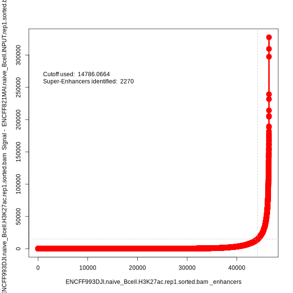

```{r, include=FALSE}
library(BiocStyle)
knitr::opts_chunk$set(echo = TRUE, fig.align = "center", message = FALSE, warning = FALSE)
```

# Introduction

**ECLIPSE** (**E**nhancer **C**alling and **L**inking with **I**ntegrated **P**rofiling and **S**tructure **E**valuation) provides a performant 
implementation of the [rank ordering of super enhancers (ROSE)](http://younglab.wi.mit.edu/super_enhancer_code.html) method for identifying super enhancers.
It provides options to increase the robustness of ROSE via signal transformations prior to thresholding and additional thresholding approaches.
It also increases flexibility by exposing parameters hidden in the original implementation.
ECLIPSE additionally contains novel functionality to identify sub-structural changes within enhancer regions between groups via sliding window and binning approaches.
It also contains visualization functions to generate high-quality plots of specific loci alongside arbitrary user-provided data.

## Installation

**ECLIPSE** is currently available on Github and can be installed as follows:

```{r, eval = FALSE}
if (!requireNamespace("devtools", quietly = TRUE))
    install.packages("devtools")

devtools::install_github("stjude-biohackathon/ECLIPSE")
```

## Usage

Given a BAM file and a BED file of peaks, ROSE can be run with the `run_rose` function.
Optionally, a control BAM file for input or IgG from the same sample can be provided.

Alternatively, `bamFile` objects and a `GRanges` object for the peaks can be provided.

The output is a `GRanges` object containing all putative enhancers with their super enhancer designation in the `super` metadata column.

```{r, eval = FALSE}
library(ECLIPSE)

sample_bam <- "/path/to/bam.bam"
control_bam <- "/path/to/control.bam"
peaks <- "/path/to/peaks.bed"

putative_enhancers <- run_rose(sample.bam = sample_bam, control.bam = control_bam, peaks = peaks)

putative_enhancers
```

## Comparison to Original ROSE Implementation

With default parameters, `run_rose` is an attempt to match the results from the original ROSE implementation as closely as possible.

For comparison's sake, here is the enhancer ranking curve from the original ROSE implementation for [H3K27ac Mint-ChIP-seq from
naive B cells](https://www.encodeproject.org/experiments/ENCSR660EVU/) as provided by ENCODE:

```{r, fig.cap="Enhancer rank plot output by original ROSE implementation.", echo=FALSE}

```

These results are using no TSS exclusion to compare the underlying classification approach as closely as possible.

Here is the enhancer ranking curve returned from ECLIPSE after `run_rose` on the same data:

```{r}
library(ECLIPSE)
data("ENCSR660EVU_putative_enhancers", package = "ECLIPSE")
plot_enhancer_curve(ENCSR660EVU_putative_enhancers)
```

Notably, the number of super-enhancers identified are not a perfect match due to very slight differences in the coverage calculations.
However, all super-enhancers identified in the original implementation are also called by ECLIPSE.
Determination of the root cause of the minor discrepancy is ongoing.


## SessionInfo

<details>

<summary>Click to expand</summary>

```{r, echo = FALSE}
sessionInfo()
```

</details>
